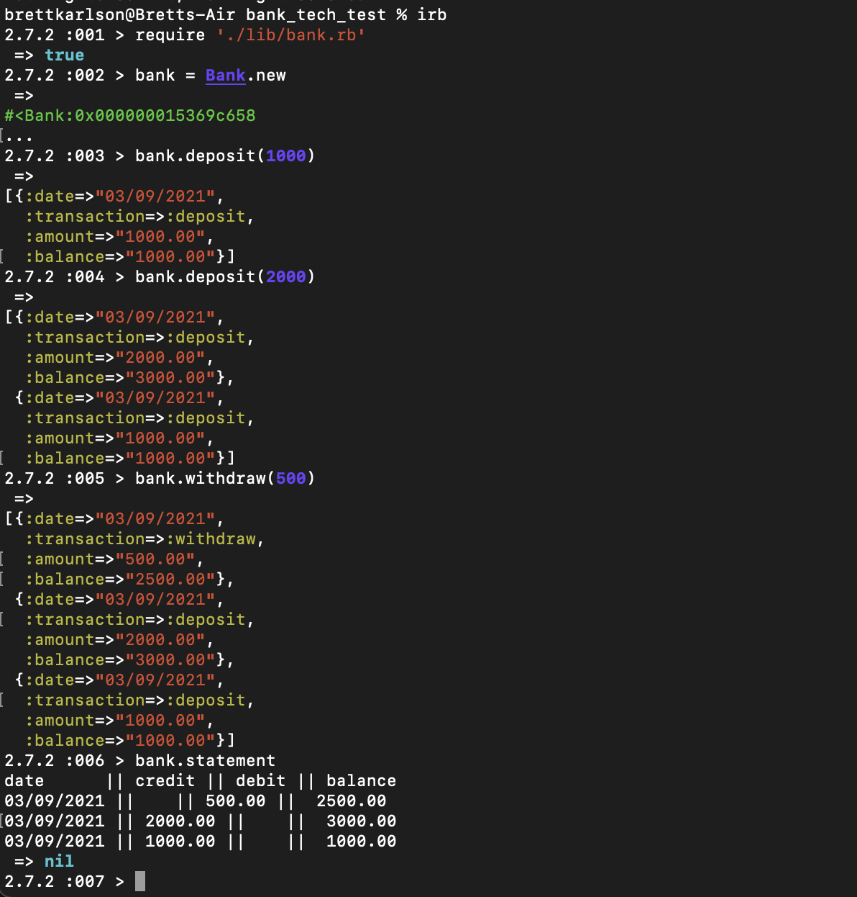

# A practice tech test at Makers

This is a simple banking app with deposit and withdrawal methods. Attributes to be displayed will be date, balance, and deposit and withdrawal amounts.

All feature testing was done via irb at the command line.
To use, clone and run bundle install.
Run on the command line - a screenshot of an example is displayed below:

To test, run rspec, and the linter is rubocop.
